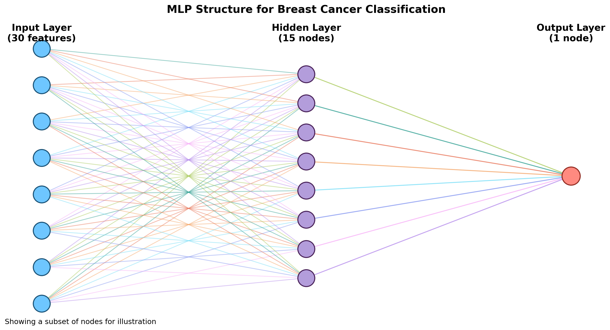
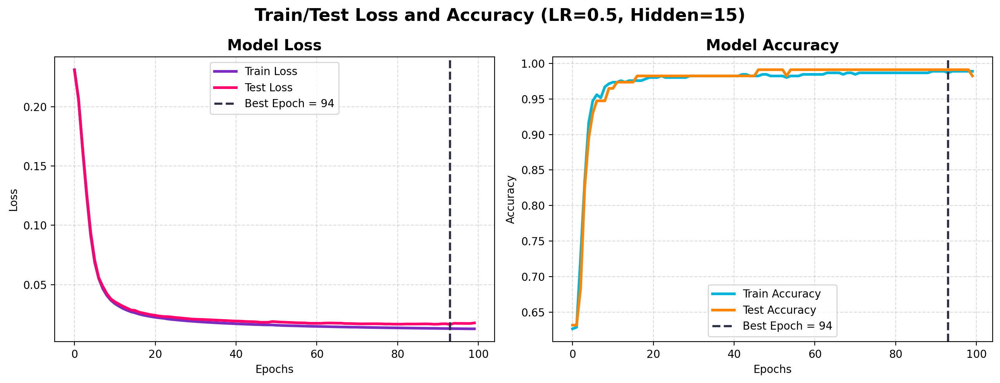
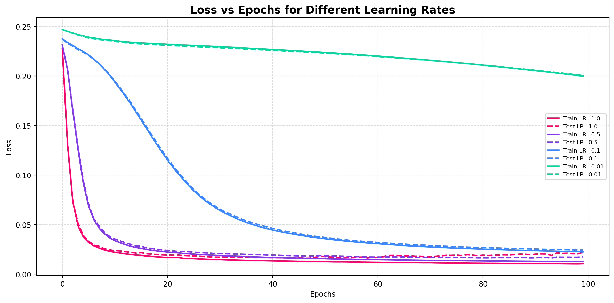
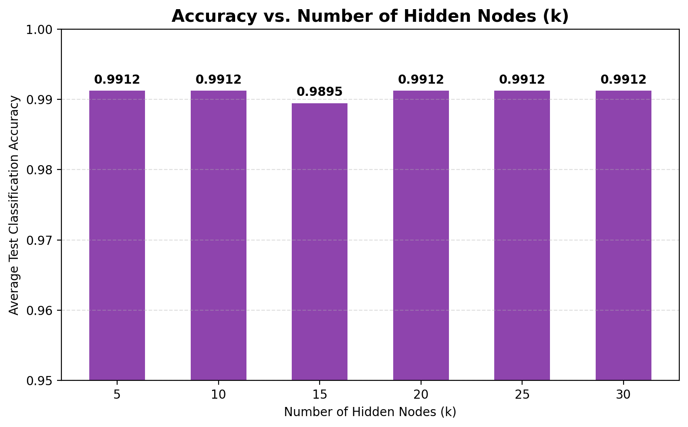

# Breast Cancer MLP Classifier

A Multi-Layer Perceptron (MLP) neural network implemented **from scratch** using Python and NumPy — no high-level ML frameworks — to classify breast tumors as benign or malignant using the Wisconsin Diagnostic Breast Cancer (WDBC) dataset.

---

##  What This Project Covers

* Manual data loading and preprocessing from the raw `wdbc.data` file
* Manual feature standardization (zero mean, unit variance)
* Stratified train/test split (80% / 20%)
* A fully connected MLP built from scratch:
  * One hidden layer with Sigmoid activation
  * Forward propagation
  * Backpropagation (chain rule, manually derived)
  * Squared-loss (MSE) error function
  * Mini-batch gradient descent (batch size = 32)
* Manual evaluation metrics: Accuracy, Precision, Recall, F1-Score
* Experiments on learning rate and hidden layer size
* All results visualized with Matplotlib

---

##  Dataset

The project uses the **Wisconsin Diagnostic Breast Cancer (WDBC)** dataset from the UCI Machine Learning Repository (`wdbc.data`).

| Property | Value |
|---|---|
| Total instances | 569 |
| Number of features | 30 |
| Class labels | Benign (B → 0), Malignant (M → 1) |
| Training set size | 80% (455 instances) |
| Test set size | 20% (114 instances) |
| Data splitting | Stratified split (scikit-learn) |
| Feature scaling | Manual standardization (zero mean, unit variance) |

---

##  Model Architecture

| Layer | Details |
|---|---|
| Input | 30 neurons (one per feature) |
| Hidden | 15 neurons, Sigmoid activation |
| Output | 1 neuron, Sigmoid activation |

**Hyperparameters:** Learning Rate = 0.5 · Epochs = 100 · Batch Size = 32

---

##  Results

### Final Model Performance (LR = 0.5, Hidden = 15, 100 epochs)

| Accuracy | Precision | Recall | F1-Score |
|---|---|---|---|
| 98.2% | 100.0% | 95.2% | 97.6% |

The model reached its lowest test loss at **epoch 94**, with no significant overfitting — training and test curves stayed close throughout.

### Effect of Learning Rate

Learning rates `[1.0, 0.5, 0.1, 0.01]` were compared. LR = 0.5 gave the best balance between fast convergence and stable training.

### Effect of Hidden Layer Size

Hidden layer sizes `[5, 10, 15, 20, 25, 30]` were compared (averaged over 5 random seeds each). Most sizes converged to ~99.1% accuracy, showing the dataset doesn't require a large hidden layer.

*For the full write-up, methodology, and discussion, see the [Project Report](Project_Report.pdf).*

---

##  Repository Structure

* `mlp_project.py` - Full implementation: data loading, MLP class, training loop, evaluation, and all experiments/plots.
* `wdbc.data` - Wisconsin Diagnostic Breast Cancer dataset (raw CSV).
* `figure1_mlp_structure.png` - Diagram of the network architecture.
* `figure2_loss_accuracy.png` - Train/test loss and accuracy curves.
* `figure3_learning_rates.png` - Loss curves for different learning rates.
* `figure4_hidden_nodes.png` - Accuracy vs. number of hidden nodes.
* `Project_Report.pdf` - Full project report and analysis.

---

##  How to Build and Run

1. Clone the repository:
 
   https://github.com/RawanFaAlotaibi/Breast-Cancer-MLP-Classification

2. Install the required libraries:

   pip install numpy matplotlib scikit-learn
   

3. Make sure `mlp_project.py` and `wdbc.data` are in the same directory, then run:
 
   python mlp_project.py
  

The script will train the model, print the evaluation metrics to the console, and regenerate all four figures.

---

##  Author

**Rawan Alotaibi**  
*Computer Science | Focused on Cybersecurity & SOC Operations*  
 [LinkedIn Profile][[(https://www.linkedin.com/in/rawan-alotaibi)](https://www.linkedin.com/in/rawan-alotaibi-](https://www.linkedin.com/in/rawan-alotaibi-077318431/)077318431/)
 

It was prepared and written in collaboration with my teammates on the project
